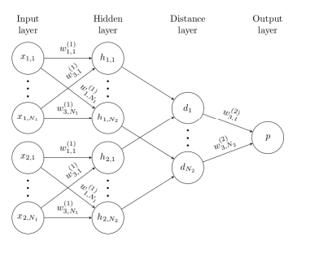
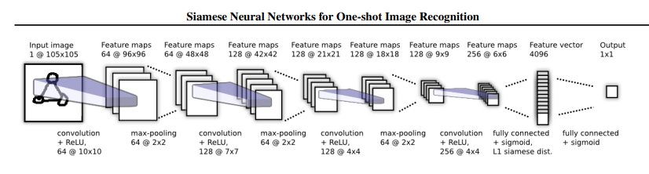
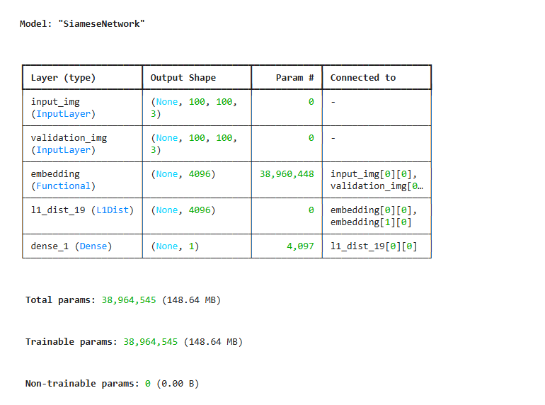

# 🧠 Facial Verification using Siamese Neural Network

## 📌 Overview
This project implements a **Siamese Neural Network (SNN)** for **face verification**, where the goal is to determine whether two face images belong to the **same person** or **different persons**.

Unlike traditional classification models, this system learns **similarity between image pairs** by generating embeddings and comparing them using a distance metric.

---

## 🔍 Problem Statement
Given two face images:
- Output **1** → Same identity
- Output **0** → Different identities

This is a **one-shot / few-shot learning** problem.

---

## 🧩 Why Siamese Neural Networks?
- Face verification is a **similarity learning** task
- Siamese networks learn **embeddings**, not class labels
- Works well for **unseen identities**
- Commonly used in biometric security systems

---

## 🏗️ Siamese Network Architecture

### 🔹 High-Level Siamese Architecture
The model consists of two identical subnetworks with **shared weights**.  
Each network extracts features from an input image, and the embeddings are compared using a **distance layer**.

---

### 🔹 CNN-based Embedding Network
Each input image is passed through a CNN to generate a **feature embedding**, followed by an L1 distance computation and a sigmoid classifier.

---
## 📐 Model Summary
The following diagram shows the **final Siamese model architecture**, including:
- Dual input layers
- Shared embedding network
- Custom L1 distance layer
- Binary classification output

---

## 🔬 Model Details
- **Input size:** 100 × 100 × 3 (RGB)
- **Embedding network:** Convolutional Neural Network
- **Distance metric:** L1 (absolute difference)
- **Output:** Similarity probability
- **Loss function:** Binary Cross-Entropy
- **Optimizer:** Adam

---

## 🔁 Training Strategy
- Custom training loop using **`tf.GradientTape`**
- Mini-batch training
- Each epoch performs **one gradient update per batch**
- Anchor–positive–negative image pairing strategy

---

## 📊 Evaluation Metrics
Accuracy is **not reliable** for Siamese networks due to class imbalance and threshold sensitivity.

Used metrics:
- **Precision** – reliability of positive predictions
- **Recall** – ability to detect true matches

---

## ⚠️ Results & Observations
- Model trained on **CPU-only environment**
- Limited epochs due to hardware constraints
- Accuracy appears low because Siamese networks require **threshold tuning**
- Embedding quality improves gradually with training

---

## 🚧 Limitations
- No GPU acceleration
- Training from scratch without pre-trained embeddings
- Limited epochs
- Threshold not extensively tuned

---

## 🚀 Future Improvements
- Use pre-trained models like **FaceNet / ArcFace**
- Train on GPU (Google Colab)
- Normalize embeddings before comparison
- Tune similarity threshold using ROC curves
- Reduce embedding dimensionality

---

## 📚 Research Paper Reference
This project is inspired by the original research paper:

**Siamese Neural Networks for One-shot Image Recognition**  
Koch, Zemel, Salakhutdinov  
🔗 https://www.cs.cmu.edu/~rsalakhu/papers/oneshot1.pdf

---

## 🛠️ Technologies Used
- Python
- TensorFlow / Keras
- OpenCV
- NumPy
- Matplotlib
- Jupyter Notebook

---

## 👤 Author
**Mohammed Abraar Hussain**  
Computer Science Engineer  
Passionate about Machine Learning, Deep Learning & AI

---

⭐ *This project focuses on architectural understanding and practical deep learning implementation rather than achieving state-of-the-art accuracy.*

